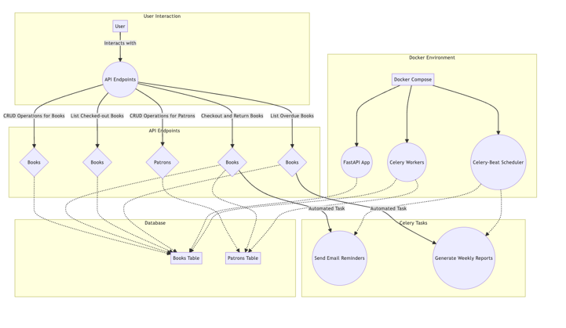

# Library Management System
The Library management system implemented using FastAPI, SQLAlchemy, Celery, and other tech stack. 
The app provides APIs for managing books, patrons and background tasks for sending email reminders and generating reports.

## Features
**Book Management**: CRUD operations for books, including checkout and return functionality.

**Patron Management**: CRUD operations for library patrons.

**User Authentication**: Basic authentication for user access control.

**Background Tasks**: Celery tasks for sending email reminders for overdue books and generating weekly reports.

## Project Structure
The project is organized into the following directories:

**api**: Contains API endpoints for books and patrons.

**core:** Includes configuration settings and security mechanisms.

**db:** Defines database models and repositories for handling interaction with database.

**tasks:** Contains Celery tasks for background processing.

**utils**: Contains utility functions, such as email.

## For local installation
Firstly we need to build the docker-compose
```bash
docker-compose build
```
Later we need to up our docker-compose

```bash
docker-compose up
```

## Celery Integration

Celery is used in your library management system to handle background tasks asynchronously.

- Tasks like sending email reminders and generating reports are defined as functions in the `tasks` directory.
- These tasks are triggered when certain conditions are met or scheduled to run at specific intervals using Celery-Beat.
- Celery executes these tasks in the background, allowing the main application to continue serving requests without delays.

# **Flowchart for the Library Management App**

<center>



</center>

